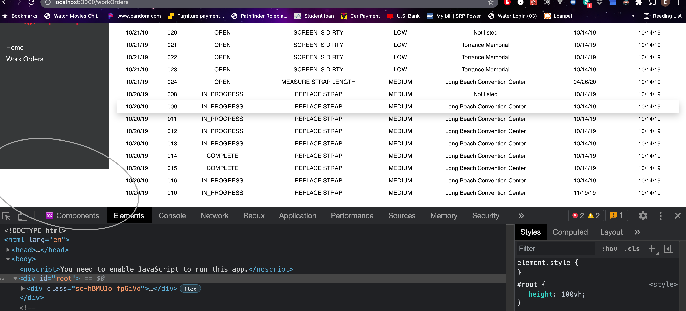
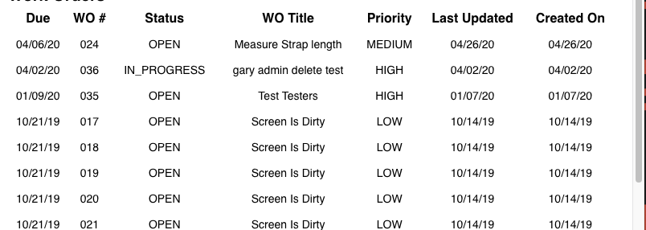
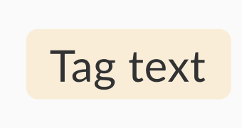

### README

## Available Scripts

In the project directory, you can run:

Use `yarn` or `npm` whichever you are comfortable with.

### `yarn install`

Install the dependencies

### `yarn start`

As you noticed, when starting up the application there is some compile errors. This is expected and part of the project to debug the issue.

Runs the app in the development mode.<br />
Open [http://localhost:3000](http://localhost:3000) to view it in the browser.

The page will reload if you make edits.<br />
You will also see any lint errors in the console.

### `yarn test`

Launches the test runner in the interactive watch mode.<br />
See the section about [running tests](https://facebook.github.io/create-react-app/docs/running-tests) for more information.

## Requirements

You may use whatever tool you like to solve these problems. Material UI is already installed in this project and we also use this in our production code as well.

### Debug some issues to get the app running locally

We have sprinkled some bugs throughout the code. Please let us know below what you fixed to get the app working locally in the list below.

**Bug List**

- **`Line 10:111: Parsing error: Identifier 'location' has already been declared.`**
  - `location` had already been declared on line 7 - `const location = useLocation();` opted for just destructuring the needed key from the `useLocation` hook - `const { state } = useLocation();`
- **The linter wasn't following the configurations from `.eslintrc.json`**
  - This appeared to be caused by this key within the `package.json`
  - ```
    "eslintConfig": {
      "extends": "react-app"
    },
    ```
  - updated the "extends" value in `.eslintrc.json` to `"extends": ["eslint:recommended", "react-app"]`
- **`WorkOrder.js:24 - TypeError: Cannot read property 'toUpperCase' of undefined`**
  - caused when `title` is `undefined` - prevented page from breaking with optional chaining `title?.toUpperCase()`
- **`WorkOrderDetails.js:47 TypeError: Cannot read property 'map' of null`**
  - no check to ensure `location` is an array - optional chaning to the rescue again! - `location?.map(loc =>`_`...rest of code`_
- **There was an issue where the side nav was appearing a bit shorter than the rest of the page:**
  - 
  - there was a sneaky style placed in the `index.css` -> `#root { height : 100vh; }` removing that fixed it right up.
- **The tests weren't invoking the function at the end of the `expect` statements**
  - corrected to invoke - `toBeInTheDocument()`

## Work Order List

### Convert class component into functional component

Please convert `src/components/WorkOrders/WorkOrders.js` into a functional component.

### Add Location to work order module

In the stub `src/stubs/workOrders.json` some work orders have locations. Please add another column for this and display this on to the page. You just need the `name` field from location.

### Make table header fixed on scroll



Provide the ability for the header (WO# / Status / Title / etc) of this table to be fixed on scroll. When scroll vertically on the page, the header also follows.

### Build a component for Status Columns



Given these status build a reusable component that display the status text and different color background based on the status.

- OPEN
  - Text: Open
  - Background: Blue
- IN_PROGRESS
  - Text: In Progress
  - Background: Yellow
- ON_HOLD
  - Text: On Hold
  - Background: Red
- COMPLETE
  - Text: Complete
    - Background: Green

## Work Order Details

### Add edit button to go into edit mode

Going into edit mode should make these fields editable. You may use any Material UI input (Buttons / inputs / dropdowns) components if needed.
In edit mode the `edit` button should become the `save` button and should save the state of the updates.

- Priority
  - Dropdown values of `['HIGH', 'MEDIUM', 'LOW']`
  - Selecting a value should update the priority
- Title
- Description

### Handle error scenario when `/workOrders:id` does not exist

If a work order id does not exist, please add a view that captures this behavior and display content that says this work order id does not exist.
